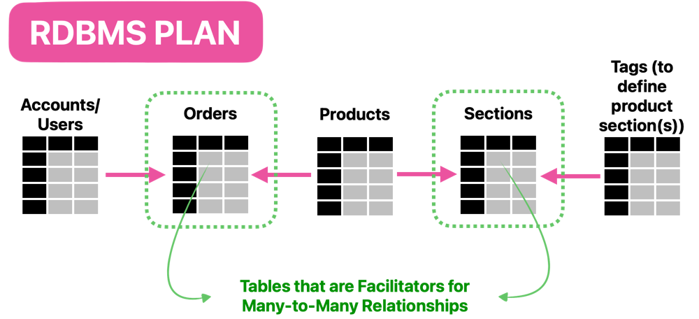
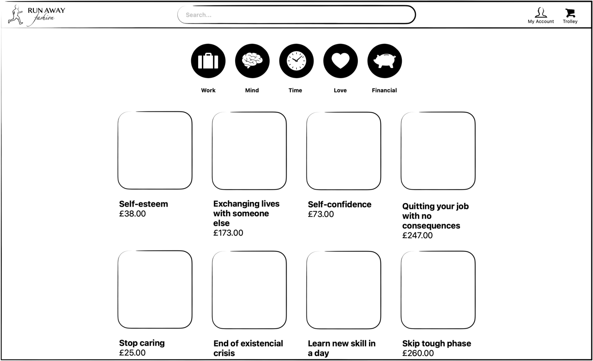

# Run Away Fashion
Run Away Fashion is a mock e-commerce where you can pretend to shop for quick solutions to your 
problems - like self-esteem or a new skill.


## Running Locally

### Step 1: Running the Backend:
- From the root, paste the following commands into your terminal:
    ```bash
    cd server
    ```
    ```bash
    ./mvnw spring-boot:run
    ```
- Access this API at `http://localhost:8080/browse/` or `http://localhost:8080/browse/product/01`

### Step 2: Running the Frontend:
- Make sure you're using node version `21.7.3` 
- Open a new terminal tab and, from the root, paste the following commands into your terminal:
    ```bash
    cd client
    ```
    ```bash
    npm run dev
    ```
- Access it at `http://localhost:3000`

## Project Info

### Used Technologies

#### Backend
- Java
- Spring
  - Boot
  - Web
- Maven

#### Frontend
- Tailwind
- ESlint
- React
- TypeScript
- Next.js
- npm & nvm

### Future plans

- Deploy to AWS
- CI/CD
- GitHub Actions

#### Backend
 - Create RDBMS - Postgres/AWS (see plan below)
 - Endpoints:
   - runaway-fashion.co.uk/ (HOMEPAGE)
   - runaway-fashion.co.uk/browse/{section} (PLP - section would be an optional filter)
   - runaway-fashion.co.uk/product/{productId} (PDP)
 - Automated tests

DB plan:



#### Frontend
- Implement layout for website:
  - product display pages (PDPs)
  - browse pages
    - general browsing page for every product and create option to filter sections such as: 
      finance, mind/mental health, work, etc.
  - homepage - telling more about the website
- Automated tests

Browse page wireframe (made using freeform):

